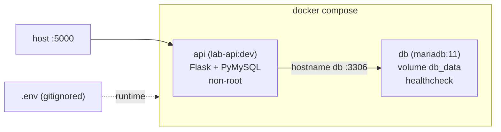
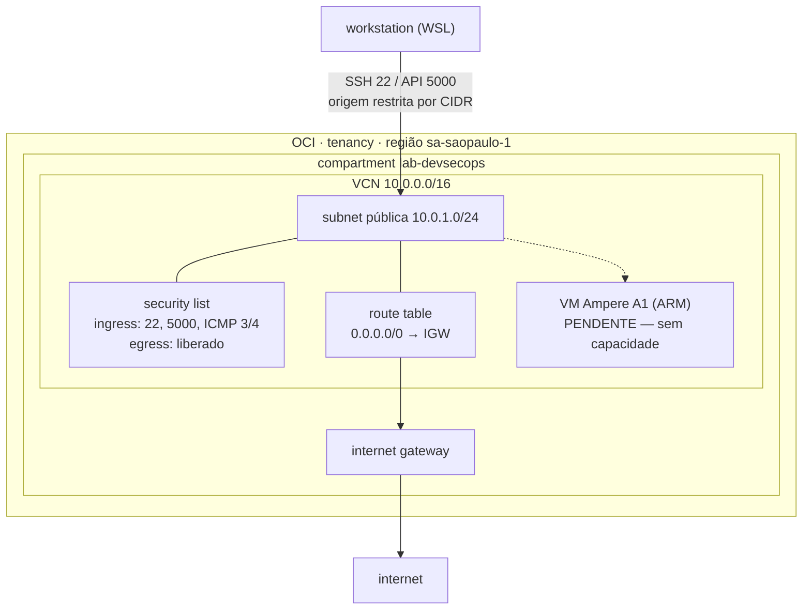

# Arquitetura - Lab DevSecOps

> Documento vivo. Registra o estado da stack, as decisões tomadas e o porquê de cada uma.
> Padrão: ADR (Architecture Decision Record) por decisão relevante.

| Campo | Valor |
|---|---|
| Projeto | `lab-devsecops` |
| Sprints documentadas | Sprint 1 - Fundação (Linux, Docker, Git avançado) · Sprint 2 - IaC (Terraform, Oracle Cloud) |
| Ambiente de desenvolvimento | WSL Ubuntu sobre Windows |
| Repositório | público (portfólio) |
| Status | Sprint 1 concluída · Sprint 2 em andamento |

---

## 1. Objetivo do Sprint 1

Consolidar a base que sustenta todo o resto do lab: uma aplicação containerizada, subindo local com um comando, com fluxo de trabalho de equipe simulado via pull request. Nada aqui é sofisticado de propósito. O aprendizado está no entorno (container, orquestração local, Git profissional), não no código da aplicação.

Entrega: aplicação containerizada, rodando via `docker compose up`, com fluxo de PR ativo e proteção de branch na `main`.

---

## 2. Diagrama da stack

```
                      docker compose (rede interna do projeto)
   host                ┌──────────────────────────────────────────┐
   :5000  ───────────► │  api (lab-api:dev)                        │
                       │  Flask + PyMySQL                          │
                       │  build local ./app, usuário não-root      │
                       │  recebe apenas DB_NAME/DB_USER/DB_PASSWORD │
                       │            │                              │
                       │            │ hostname "db" :3306          │
                       │            ▼                              │
                       │  db (mariadb:11)                          │
                       │  volume nomeado db_data → persistência    │
                       │  healthcheck (healthcheck.sh)             │
                       └──────────────────────────────────────────┘

   segredos: .env (gitignored) → injetado no compose em runtime
```

Versão mermaid (renderiza no GitHub):



---

## 3. Componentes

### 3.1 API (`app/`)
Aplicação Flask mínima, com dois endpoints:
- `/` - health check, retorna `{"status": "ok"}` (mais um timestamp UTC adicionado depois, via PR, como vetor de teste do fluxo GitFlow).
- `/db` - testa a conexão com o banco via PyMySQL, lendo credenciais das variáveis de ambiente (`DB_HOST`, `DB_PORT`, `DB_USER`, `DB_PASSWORD`, `DB_NAME`). Retorna a versão do MariaDB em caso de sucesso.

Dependências fixadas em `requirements.txt`: `flask==3.0.3`, `pymysql==1.1.1`.

### 3.2 Imagem (`app/Dockerfile`)
Build multi-stage, base `python:3.12-slim`, execução como usuário não-root `appuser`. Detalhes no ADR-001 e ADR-002.
`.dockerignore` exclui `.venv`, `__pycache__`, `.git`, `.env` e afins, para não poluir o contexto de build.

### 3.3 Stack (`docker-compose.yml`, na raiz)
Dois serviços:
- `api`: build local a partir de `./app`, exposto na porta 5000.
- `db`: `mariadb:11`, com volume nomeado `db_data` em `/var/lib/mysql` e healthcheck.

A `api` só sobe depois que o `db` está saudável (`depends_on` com `condition: service_healthy`). A comunicação entre eles usa o hostname `db` da rede implícita do compose. Ambos com `restart: unless-stopped`.

### 3.4 Segredos (`.env`)
Credenciais do banco em `.env` na raiz, fora do versionamento. `.env.example` commitado como referência. Detalhes e plano de evolução no ADR-004.

---

## 4. Infraestrutura como código (Sprint 2)

A partir da Sprint 2 o provisionamento sai do console web e passa a ser descrito em código. O provedor é a Oracle Cloud Infrastructure (OCI), no Always Free Tier.

### 4.1 Diagrama da infraestrutura



### 4.2 Estrutura de arquivos (`terraform/`)

| Arquivo | Responsabilidade |
|---|---|
| `provider.tf` | versão do Terraform, provider `oracle/oci` e sua configuração |
| `variables.tf` | declaração de todas as variáveis de entrada |
| `main.tf` | data sources de identidade (availability domains, compartment) |
| `network.tf` | VCN, internet gateway, route table, security list, subnet |
| `compute.tf` | data source da imagem Ubuntu ARM e a instância |
| `outputs.tf` | valores exportados (OCIDs, IP público, comando SSH) |
| `terraform.tfvars` | valores reais do ambiente — **não versionado** |
| `terraform.tfvars.example` | referência de preenchimento — versionado |
| `.terraform.lock.hcl` | trava a versão do provider — versionado |

A separação por arquivo é convenção, não exigência: o Terraform concatena todos os `.tf` do diretório antes de avaliar. O ganho é de legibilidade e de revisão de PR.

### 4.3 Ordem de criação e grafo de dependências

Em nenhum ponto do código a ordem de criação é declarada. O Terraform a deduz das referências entre recursos: quando um `subnet` referencia `oci_core_route_table.public.id`, isso é uma aresta no grafo. O resultado é um grafo acíclico dirigido, com criação em paralelo do que é independente e serialização do que não é.

```
subnet ──> route_table ──> internet_gateway ──> vcn
   └─────> security_list ────────────────────────┘
```

Confirmado na execução: a VCN primeiro, depois `security_list` e `internet_gateway` em paralelo, depois a `route_table`, e por último a `subnet`. O grafo pode ser inspecionado com `terraform graph` (saída em formato DOT).

---

## 5. Decisões arquiteturais (ADRs)

### ADR-001 - Build multi-stage
**Status:** aceito.
**Contexto:** um build single-stage carrega ferramentas de compilação e cache de pip para dentro da imagem final. Isso incha a imagem e amplia a superfície de ataque sem necessidade.
**Decisão:** separar em dois estágios. O estágio `builder` instala as dependências num prefixo isolado. O estágio final copia só o que foi instalado, sem ferramentas de build nem cache.
**Consequências:** imagem final menor e mais limpa, com menos pacotes para um scanner de vulnerabilidade apontar. É o padrão que revisores e scanners de segurança esperam ver.

### ADR-002 - Container como usuário não-root
**Status:** aceito.
**Contexto:** por padrão o processo dentro do container roda como root. Se a aplicação for comprometida, o atacante herda root no contexto do container, o que aumenta o raio de impacto.
**Decisão:** criar um usuário `appuser` no Dockerfile e rodar a aplicação com ele. O usuário é criado antes do `COPY` do código, e o código é copiado já com `COPY --chown=appuser:appuser` para evitar arquivo pertencente a root e a falha de permissão em runtime.
**Consequências:** menor raio de impacto em caso de comprometimento, aplicando princípio de menor privilégio. Coerente com a disciplina de PAM que já é meu terreno. Custo: exige atenção à ordem das instruções e à posse dos arquivos no Dockerfile.

### ADR-003 - MariaDB como banco
**Status:** aceito.
**Contexto:** o lab precisa de um banco relacional para exercitar o compose com múltiplos serviços, volume e healthcheck. Postgres seria uma escolha comum.
**Decisão:** usar `mariadb:11` de propósito, para conectar o lab com a bagagem que já tenho de MariaDB e Galera em produção.
**Consequências:** o conhecimento operacional transfere direto (comportamento do engine, healthcheck via `healthcheck.sh`, gestão de usuários). Reforça o diferencial do perfil em vez de aprender um banco novo do zero só para o exercício.

### ADR-004 - Segredos via `.env` nesta fase (débito consciente)
**Status:** aceito, com plano de migração.
**Contexto:** a stack precisa de credenciais de banco. A solução final para o lab é o HashiCorp Vault, previsto para o Sprint 4. Adotar Vault já no Sprint 1 tiraria o foco da fundação.
**Decisão:** manter as credenciais num `.env` na raiz, fora do Git (`.gitignore`), com `.env.example` versionado como referência. A `api` recebe apenas as credenciais de aplicação (`DB_NAME`, `DB_USER`, `DB_PASSWORD`), nunca a senha de root do banco.
**Consequências:** solução simples e suficiente para desenvolvimento local. Segregar a credencial de root da credencial de aplicação já aplica menor privilégio desde agora. Fica registrado o débito técnico: na Sprint 4, `.env` é substituído por Vault. Registrar isso de forma consciente é prática de engenharia madura, não um esquecimento.

### ADR-005 - GitFlow com pull request e proteção de branch
**Status:** aceito.
**Contexto:** commitar direto na `main` não simula um fluxo de equipe e não exercita revisão nem gate de merge.
**Decisão:** trabalhar por feature branches, com commit semântico, abrir PR, revisar o próprio diff e fazer merge por squash. A `main` recebe uma regra (ruleset) exigindo PR antes do merge e bloqueando force push. Zero aprovações obrigatórias, para não travar o fluxo de um único autor. O repositório foi tornado público, o que habilita a proteção de branch no plano gratuito do GitHub.
**Consequências:** histórico limpo por squash, gate de merge ativo, push direto na `main` rejeitado. Convenção de commit adotada daqui em diante: `feat:`, `fix:`, `docs:`, `chore:`, `refactor:`.

### ADR-006 - Terraform sobre Oracle Cloud Free Tier
**Status:** aceito.
**Contexto:** o lab precisa de infraestrutura real para exercitar IaC, mas não pode gerar custo recorrente. AWS e Azure oferecem crédito temporário que expira; a OCI oferece recursos Always Free sem prazo, incluindo a shape ARM Ampere A1 com 4 OCPUs e 24 GB no total do tenancy.
**Decisão:** usar Terraform com o provider `oracle/oci` sobre a Oracle Cloud Free Tier, região `sa-saopaulo-1`. Recursos isolados num compartment dedicado `lab-devsecops` em vez do compartment raiz.
**Consequências:** infraestrutura permanente sem custo, com margem de recursos suficiente para rodar a stack Docker do Sprint 1 na nuvem. O compartment dedicado permite policy, quota e limpeza segregadas do resto do tenancy. Custo da escolha: menor disponibilidade de capacidade ARM que os provedores maiores (ver ADR-009) e ecossistema de exemplos menor que o de AWS.

### ADR-007 - Autenticação por API key com credenciais fora do repositório
**Status:** aceito, com débito registrado.
**Contexto:** o provider precisa autenticar na API da OCI. Os identificadores da conta (tenancy OCID, user OCID, fingerprint) e a chave privada são material sensível, e o repositório é público.
**Decisão:** autenticação por par de chaves RSA, com a chave privada em `~/.oci/` (permissão `600`) e nunca dentro do repositório. Os valores do ambiente ficam em `terraform.tfvars`, coberto pelo `.gitignore`, com um `terraform.tfvars.example` versionado servindo de referência de onboarding. O `.gitignore` também bloqueia `*.pem`, `*.key`, `*.tfstate*` e `.terraform/`. O `.terraform.lock.hcl` é versionado deliberadamente, para travar a versão do provider entre máquinas.
**Consequências:** nenhum segredo no repositório público, e quem clona sabe exatamente o que precisa preencher. Verificação adotada antes de cada push: `git ls-files | grep -E '\.env$|\.tfvars$|\.pem$|\.key$'` precisa retornar vazio. Vale registrar que o `.gitignore` só protege arquivo ainda não rastreado, então a checagem não é redundante.

### ADR-008 - Security list restritiva por origem
**Status:** aceito.
**Contexto:** a subnet é pública e a VM terá IP roteável na internet. Porta 22 aberta para `0.0.0.0/0` é a exposição mais varrida por bots em cloud pública, e comprometimento por força bruta em SSH é rotina, não exceção.
**Decisão:** ingress liberado apenas para CIDR de origem conhecida, parametrizado em `ssh_allowed_cidr` e `api_allowed_cidr`, ambos declarados **sem valor padrão**. A ausência de `default` é intencional: obriga decisão explícita a cada ambiente e impede que alguém aplique a stack sem pensar na origem. Egress liberado, necessário para `apt`, `docker pull` e afins. Incluída regra de ICMP tipo 3 código 4 (Path MTU Discovery), sem a qual conexões travam de forma intermitente e difícil de diagnosticar.
**Consequências:** superfície de exposição mínima, aplicando o mesmo princípio de menor privilégio já adotado no ADR-002. Custo operacional: IP residencial dinâmico exige reaplicar a stack quando muda. O atrito é deliberado e preferível à alternativa. Os CIDRs de rede (`vcn_cidr`, `subnet_public_cidr`) mantêm `default`, por serem decisão de arquitetura e não dado de ambiente.

### ADR-009 - Provisionamento da VM bloqueado por capacidade (pendência externa)
**Status:** aceito como pendência, código mantido em versionamento.
**Contexto:** a shape `VM.Standard.A1.Flex` (Ampere ARM) é o recurso mais disputado do Always Free. As tentativas de `apply` em `sa-saopaulo-1` retornam `500-InternalError, Out of host capacity`, tanto com 2 OCPU / 12 GB quanto com 1 OCPU / 6 GB. O `plan` valida sem erro e a requisição chega à API com resposta da Oracle, o que confirma limitação de plataforma e não defeito de configuração.
**Decisão:** manter `compute.tf` versionado com o `apply` pendente, e retomar as tentativas periodicamente em janelas de menor demanda. Tentativas manuais e espaçadas, nunca automatizadas em laço: retry agressivo em `LaunchInstance` é tratado como abuso pela Oracle e pode suspender a conta.
**Consequências:** as tarefas seguintes que dependem apenas de código (modularização, pipeline) seguem sem bloqueio. Fallback avaliado e descartado por ora: `VM.Standard.E2.1.Micro` (AMD) tem capacidade folgada, mas apenas 1 GB de RAM, insuficiente para a stack Flask + MariaDB sem risco de OOM. Se a capacidade ARM não abrir, a shape AMD entra como contorno documentado para validar SSH, cloud-init e Ansible, com a limitação declarada.

Detalhe de implementação que merece registro: o `oci_core_instance` usa `lifecycle { ignore_changes = [source_details[0].source_id] }`. A imagem vem de um data source que resolve sempre a mais recente da Canonical, e sem esse bloco cada nova publicação upstream faria o Terraform propor destruir e recriar a VM, com perda de tudo que estivesse dentro dela.

---

## 6. Débito técnico registrado

| Item | Situação atual | Plano | Sprint alvo |
|---|---|---|---|
| Segredos da aplicação | `.env` em texto plano, gitignored | Migrar para HashiCorp Vault | Sprint 4 |
| Ciclo de dev da imagem | Cada mudança de código exige `--build` | Avaliar bind mount `./app:/app` com reloader do Flask para dev | a definir |
| Estado do Terraform | `terraform.tfstate` local, em texto plano, gitignored | Migrar para backend remoto (OCI Object Storage) com criptografia e locking | a definir |
| Qualidade de IaC | Nenhuma verificação automatizada | `pre-commit` com `terraform fmt`, `tflint`, `trivy config` e `gitleaks` | a definir |
| VM Ampere A1 | Código pronto, `apply` bloqueado por capacidade | Retomar tentativas; fallback AMD documentado no ADR-009 | Sprint 2 |

Nota sobre o estado: o `tfstate` guarda em texto plano tudo que passa pelo Terraform, incluindo valores sensíveis de recursos futuros (senhas de banco, chaves geradas). Enquanto for local ele depende exclusivamente da criptografia de disco da estação, e não sobrevive à perda da máquina nem permite trabalho compartilhado. É o mesmo tipo de débito consciente do ADR-004.

---

## 7. Como subir a stack local

Na raiz `~/projetos/lab-devsecops`:

```bash
docker compose up -d
docker compose ps
curl http://localhost:5000/
curl http://localhost:5000/db
```

Teste de persistência (o volume mantém os dados):

```bash
docker compose down
docker compose up -d
curl http://localhost:5000/db
```

Atenção: `docker compose down` sem `-v` preserva o volume `db_data`. Não use `down -v`, isso apaga o banco.

---

## 8. Como aplicar a infraestrutura

Pré-requisitos: par de chaves da API cadastrado na OCI e `terraform/terraform.tfvars` preenchido a partir do `.example`.

```bash
cd terraform
terraform init
terraform fmt
terraform validate
terraform plan
terraform apply
terraform output
```

Inspecionar o grafo de dependências:

```bash
terraform graph
```

Destruir tudo que o Terraform criou:

```bash
terraform destroy
```

---

## 9. Estado atual

**Sprint 1 (concluída).** Stack sobe com um comando. Fluxo de PR ativo com proteção de branch. Documentação no ar.

**Sprint 2 (em andamento).** Rede completa provisionada por código na OCI: VCN, subnet pública, internet gateway, route table e security list restritiva, sem nenhum clique no console. Autenticação por API key validada de ponta a ponta. Provisionamento da VM pendente de capacidade ARM no free tier (ADR-009). Próximo passo: modularização do código Terraform.
