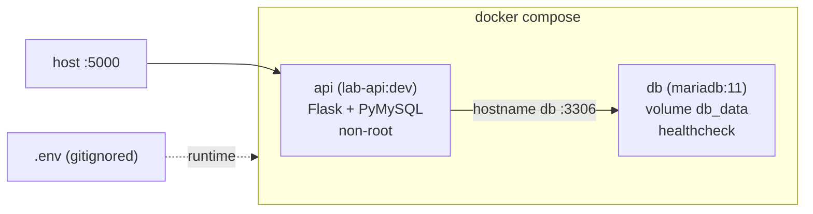

# Arquitetura - Lab DevSecOps

> Documento vivo. Registra o estado da stack, as decisões tomadas e o porquê de cada uma.
> Padrão: ADR (Architecture Decision Record) por decisão relevante.

| Campo | Valor |
|---|---|
| Projeto | `lab-devsecops` |
| Sprint documentada | Sprint 1 - Fundação (Linux, Docker, Git avançado) |
| Ambiente de desenvolvimento | WSL Ubuntu sobre Windows |
| Repositório | público (portfólio) |
| Status da Sprint 1 | Concluída |

---

## 1. Objetivo do Sprint 1

Consolidar a base que sustenta todo o resto do lab: uma aplicação containerizada, subindo local com um comando, com fluxo de trabalho de equipe simulado via pull request. Nada aqui é sofisticado de propósito. O aprendizado está no entorno (container, orquestração local, Git profissional), não no código da aplicação.

Entrega: aplicação containerizada, rodando via `docker compose up`, com fluxo de PR ativo e proteção de branch na `main`.

---

## 2. Diagrama da stack

```
                      docker compose (rede interna do projeto)
   host                ┌──────────────────────────────────────────┐
   :5000  ───────────► │  api (lab-api:dev)                        │
                       │  Flask + PyMySQL                          │
                       │  build local ./app, usuário não-root      │
                       │  recebe apenas DB_NAME/DB_USER/DB_PASSWORD │
                       │            │                              │
                       │            │ hostname "db" :3306          │
                       │            ▼                              │
                       │  db (mariadb:11)                          │
                       │  volume nomeado db_data → persistência    │
                       │  healthcheck (healthcheck.sh)             │
                       └──────────────────────────────────────────┘

   segredos: .env (gitignored) → injetado no compose em runtime
```

Versão mermaid (renderiza no GitHub):



---

## 3. Componentes

### 3.1 API (`app/`)
Aplicação Flask mínima, com dois endpoints:
- `/` - health check, retorna `{"status": "ok"}` (mais um timestamp UTC adicionado depois, via PR, como vetor de teste do fluxo GitFlow).
- `/db` - testa a conexão com o banco via PyMySQL, lendo credenciais das variáveis de ambiente (`DB_HOST`, `DB_PORT`, `DB_USER`, `DB_PASSWORD`, `DB_NAME`). Retorna a versão do MariaDB em caso de sucesso.

Dependências fixadas em `requirements.txt`: `flask==3.0.3`, `pymysql==1.1.1`.

### 3.2 Imagem (`app/Dockerfile`)
Build multi-stage, base `python:3.12-slim`, execução como usuário não-root `appuser`. Detalhes no ADR-001 e ADR-002.
`.dockerignore` exclui `.venv`, `__pycache__`, `.git`, `.env` e afins, para não poluir o contexto de build.

### 3.3 Stack (`docker-compose.yml`, na raiz)
Dois serviços:
- `api`: build local a partir de `./app`, exposto na porta 5000.
- `db`: `mariadb:11`, com volume nomeado `db_data` em `/var/lib/mysql` e healthcheck.

A `api` só sobe depois que o `db` está saudável (`depends_on` com `condition: service_healthy`). A comunicação entre eles usa o hostname `db` da rede implícita do compose. Ambos com `restart: unless-stopped`.

### 3.4 Segredos (`.env`)
Credenciais do banco em `.env` na raiz, fora do versionamento. `.env.example` commitado como referência. Detalhes e plano de evolução no ADR-004.

---

## 4. Decisões arquiteturais (ADRs)

### ADR-001 - Build multi-stage
**Status:** aceito.
**Contexto:** um build single-stage carrega ferramentas de compilação e cache de pip para dentro da imagem final. Isso incha a imagem e amplia a superfície de ataque sem necessidade.
**Decisão:** separar em dois estágios. O estágio `builder` instala as dependências num prefixo isolado. O estágio final copia só o que foi instalado, sem ferramentas de build nem cache.
**Consequências:** imagem final menor e mais limpa, com menos pacotes para um scanner de vulnerabilidade apontar. É o padrão que revisores e scanners de segurança esperam ver.

### ADR-002 - Container como usuário não-root
**Status:** aceito.
**Contexto:** por padrão o processo dentro do container roda como root. Se a aplicação for comprometida, o atacante herda root no contexto do container, o que aumenta o raio de impacto.
**Decisão:** criar um usuário `appuser` no Dockerfile e rodar a aplicação com ele. O usuário é criado antes do `COPY` do código, e o código é copiado já com `COPY --chown=appuser:appuser` para evitar arquivo pertencente a root e a falha de permissão em runtime.
**Consequências:** menor raio de impacto em caso de comprometimento, aplicando princípio de menor privilégio. Coerente com a disciplina de PAM que já é meu terreno. Custo: exige atenção à ordem das instruções e à posse dos arquivos no Dockerfile.

### ADR-003 - MariaDB como banco
**Status:** aceito.
**Contexto:** o lab precisa de um banco relacional para exercitar o compose com múltiplos serviços, volume e healthcheck. Postgres seria uma escolha comum.
**Decisão:** usar `mariadb:11` de propósito, para conectar o lab com a bagagem que já tenho de MariaDB e Galera em produção.
**Consequências:** o conhecimento operacional transfere direto (comportamento do engine, healthcheck via `healthcheck.sh`, gestão de usuários). Reforça o diferencial do perfil em vez de aprender um banco novo do zero só para o exercício.

### ADR-004 - Segredos via `.env` nesta fase (débito consciente)
**Status:** aceito, com plano de migração.
**Contexto:** a stack precisa de credenciais de banco. A solução final para o lab é o HashiCorp Vault, previsto para o Sprint 4. Adotar Vault já no Sprint 1 tiraria o foco da fundação.
**Decisão:** manter as credenciais num `.env` na raiz, fora do Git (`.gitignore`), com `.env.example` versionado como referência. A `api` recebe apenas as credenciais de aplicação (`DB_NAME`, `DB_USER`, `DB_PASSWORD`), nunca a senha de root do banco.
**Consequências:** solução simples e suficiente para desenvolvimento local. Segregar a credencial de root da credencial de aplicação já aplica menor privilégio desde agora. Fica registrado o débito técnico: na Sprint 4, `.env` é substituído por Vault. Registrar isso de forma consciente é prática de engenharia madura, não um esquecimento.

### ADR-005 - GitFlow com pull request e proteção de branch
**Status:** aceito.
**Contexto:** commitar direto na `main` não simula um fluxo de equipe e não exercita revisão nem gate de merge.
**Decisão:** trabalhar por feature branches, com commit semântico, abrir PR, revisar o próprio diff e fazer merge por squash. A `main` recebe uma regra (ruleset) exigindo PR antes do merge e bloqueando force push. Zero aprovações obrigatórias, para não travar o fluxo de um único autor. O repositório foi tornado público, o que habilita a proteção de branch no plano gratuito do GitHub.
**Consequências:** histórico linpo por squash, gate de merge ativo, push direto na `main` rejeitado. Convenção de commit adotada daqui em diante: `feat:`, `fix:`, `docs:`, `chore:`, `refactor:`.

---

## 5. Débito técnico registrado

| Item | Situação atual | Plano | Sprint alvo |
|---|---|---|---|
| Segredos | `.env` em texto plano, gitignored | Migrar para HashiCorp Vault | Sprint 4 |
| Ciclo de dev da imagem | Cada mudança de código exige `--build` | Avaliar bind mount `./app:/app` com reloader do Flask para dev | a definir |

---

## 6. Como subir a stack

Na raiz `~/projetos/lab-devsecops`:

```bash
docker compose up -d
docker compose ps
curl http://localhost:5000/
curl http://localhost:5000/db
```

Teste de persistência (o volume mantém os dados):

```bash
docker compose down
docker compose up -d
curl http://localhost:5000/db
```

Atenção: `docker compose down` sem `-v` preserva o volume `db_data`. Não use `down -v`, isso apaga o banco.

---

## 7. Estado ao fim do Sprint 1

Stack sobe com um comando. Fluxo de PR ativo com proteção de branch. Documentação inicial no ar. Base pronta para o Sprint 2, quando o provisionamento sai do "clico no console" e passa para Terraform na Oracle Cloud Free Tier.
